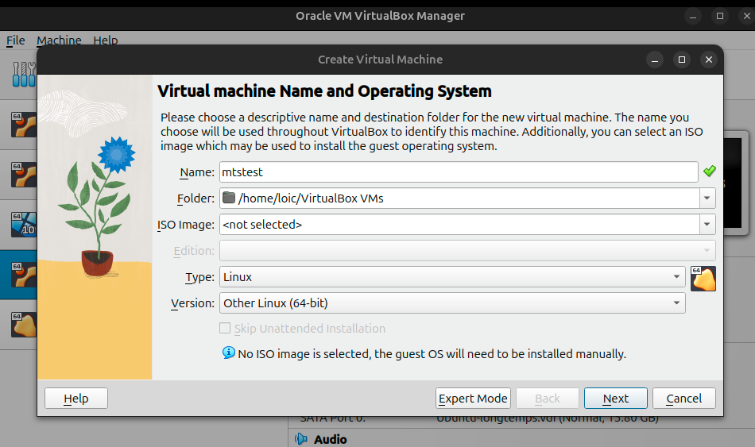
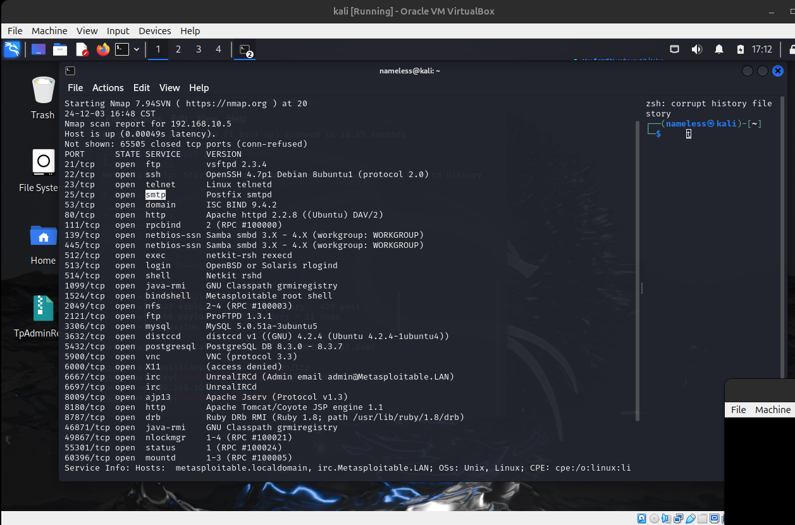

## installation



2. setup network one metasploitable : 
```bash
auto eth0
iface eth0 inet static
    address 192.168.1.100
    netmask 255.255.255.0
    gateway 192.168.1.1
```

3. nmap result : 
```bash
nmap -sV -p- 192.168.10.5
```

Result:


4. scan avec Metasploit
```bash
msfconsole
msf> use auxiliary/scanner/portscan/tcp
msf> set RHOSTS 192.168.1.X
msf> run
```